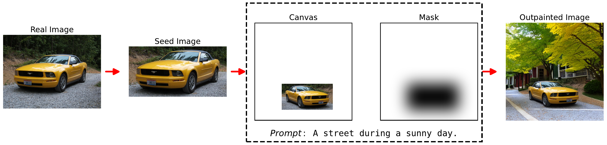

<h2 align="center">AIDOVECL: AI-generated Dataset of Outpainted Vehicles for Eye-level Classification and Localization</h1>
<h3 align="center">
  <strong>Amir Kazemi · Qurat ul ain Fatima · Volodymyr Kindratenko · Christopher Tessum</strong>
</h3>

<div align="center">
  
</div>

<p align="center">
  <a href="https://arxiv.org/abs/2410.24116">📝 View the Paper on arXiv</a>
</p>

<p align="center">
  <a href="https://huggingface.co/datasets/amir-kazemi/aidovecl">📊 Explore the Dataset on Hugging Face</a>
</p>

## Installation Guide

To set up the environment for AIDOVECL, follow these steps:

First, ensure you have `conda` or `miniconda` installed. Then, create a new conda environment using the provided `aidovecl-env.yml` file.

```bash
conda env create -f aidovecl-env.yml
conda activate aidovecl
```
<br>

Run the following command to add the environment to Jupyter:
```bash
python -m ipykernel install --user --name=aidovecl --display-name="Python (aidovecl)"
```

> **Note:** Initial runs may take longer due to model downloads.  
> **Reproducibility Disclaimer:** Random seeds are set, but full determinism is not guaranteed due to backend library limitations (see [cuBLAS](https://docs.nvidia.com/cuda/cublas/index.html#results-reproducibility), [PyTorch](https://pytorch.org/docs/stable/notes/randomness.html)).

## Reproducing Figures

The repository contains Jupyter notebooks used to generate individual figures for the AIDOVECL paper:

### `fig_01_pipeline_schematic.ipynb`
Generates the overall pipeline schematic of AIDOVECL, illustrating the steps from seed image extraction to prompt-based outpainting.

### `fig_02_detection_consensus.ipynb`
Evaluates the agreement among multiple pretrained detection models (RetinaNet, Faster R-CNN, FCOS, etc.) on real vehicle images by computing pairwise IoUs and visualizing class-wise consensus levels using radar charts.

### `fig_03_outpainted_samples.ipynb`
Showcases visual samples from different outpainted vehicle classes (e.g., sedan, SUV, van, minibus, etc.).

### `fig_04_quality_kde.ipynb`
Generates a grid of KDE plots to visualize the distributions of image quality scores (QualiCLIP, CLIP-IQA, BRISQUE) and semantic similarity scores (prompt–caption and caption–caption) for the outpainted vehicle dataset, annotated with mean and standard deviation.

### `fig_05to09_detection_performance.ipynb`
Consolidates detection performance metrics across multiple figures (5–9), comparing real vs. augmented training, ablations on MixUp/Mosaic, and detailed confusion matrix statistics. Outputs include mAP, precision, recall, fitness, and per-class analysis, while also showcasing qualitative samples of confused instances, false negatives, and false positives.

### `fig_10_generation_failures.ipynb`
Visualizes representative failure cases from the outpainted dataset, categorizing them into seven artifact types—ambiguous objects, boundary artifacts, distorted roads, extra vehicle, irrelevant background, patchwork effect, and seasonal mismatch—through qualitative grids to highlight generative limitations and contextual inconsistencies.

## An Overview of the Package

- `main.py`: serves as the entry point for running dataset generation, model training, evaluation, or semantic analysis routines based on user-specified options.

### Files under `src/`:

- `detect.py`: detects vehicles and creates seed images.
- `outpaint.py`: outpaints the seed images.
- `backdrop.py`: generates background images.
- `aidovecl.py`: defines the end-to-end dataset construction pipeline for AIDOVECL, including seed image extraction, dataset splitting, outpainting, background generation, and final augmentation. can be run as a script to produce the complete augmented dataset by merging real and synthetic splits.
- `prompt_semantics.py`: generates captions using blip and vit-gpt2 for outpainted images, computes caption–prompt and caption–caption semantic similarities, and saves results to a csv.
- `torch_models.py`: implements training, evaluation, and dataset conversion routines for benchmarking multiple torchvision detection models (fcos, retinanet, ssd, faster r-cnn) using yolo-style data. includes a custom pytorch `dataset` with support for on-the-fly mosaic and mixup augmentations, automatic conversion to coco-style annotations, modular training and testing loops, and a bulk `finetune_all()` and `test_all()` interface for evaluating different augmentation strategies across real and synthetic datasets.
- `yolo.py`: trains and evaluates yolov8 models across datasets and augmentation settings, with support for agnostic nms, metric extraction, and csv export.
- `mismatch.py`: provides a complete suite for visualizing, analyzing, and comparing detection mismatches (false positives, false negatives, and confusions) across models and dataset configurations. it includes utilities for loading predictions and annotations, matching predictions to ground truth using iou, drawing annotated sample images with legends, exporting diverse mismatch examples, and generating structured comparison grids and confusion matrix plots for quantitative and qualitative error analysis.
- `utils.py`: provides utilities for the above files.

### Files under `config/`:

- `aidovecl-config.yaml`: central configuration file for the aidovecl pipeline, defining class indices, detection buffer, outpainting parameters (canvas size, prompt templates, diffusion model, quality thresholds), etc.
- `DejaVuSans.ttf`: fallback font used for figure annotations and visualizations (e.g., mismatch grids, confusion matrices) to ensure consistent rendering when Arial is unavailable.

## Downloading Datasets for Vehicle Classification and Localization

Download the dataset from the following source: [AIDOVECL Dataset](https://huggingface.co/datasets/amir-kazemi/aidovecl/tree/main).

After downloading, extract the zipped datasets to the `datasets` folder of the repository. The structure should look like this:
```bash
datasets/
    ├── real_raw 
    │   ├── bus
    │   ├── coupe
    │   ├── minibus
    │   ├── minivan
    │   ├── pickup
    │   ├── sedan
    │   ├── suv
    │   ├── truck                                   
    │   └── van
    ├── real
    │   ├── images
    │   ├── labels
    │   └── real.yaml
    └── augmented
        ├── images
        ├── labels
        └── augmented.yaml
```